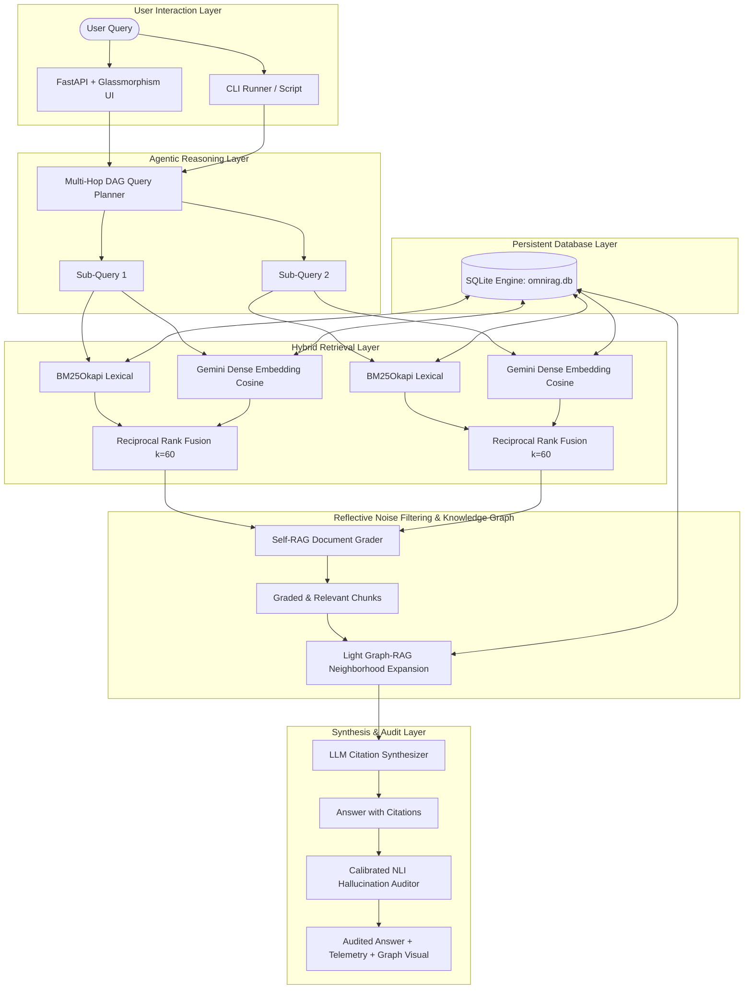

# OmniRAG System Architecture Specification

## 1. End-to-End Pipeline Diagram

## 2. Key Mathematical Formulations

- **Reciprocal Rank Fusion (RRF):**
  $$RRF(d) = \sum_{m \in \{\text{BM25}, \text{Dense}\}} \frac{1}{60 + \text{rank}_m(d)}$$

- **Cosine Similarity:**
  $$\text{sim}(\mathbf{q}, \mathbf{d}) = \frac{\mathbf{q} \cdot \mathbf{d}}{\|\mathbf{q}\|_2 \|\mathbf{d}\|_2}$$

- **Faithfulness Score:**
  $$\text{Faithfulness} = \frac{\sum_{i=1}^{N} \mathbb{I}(\text{verdict}_i = \text{ENTAILED})}{N}$$
